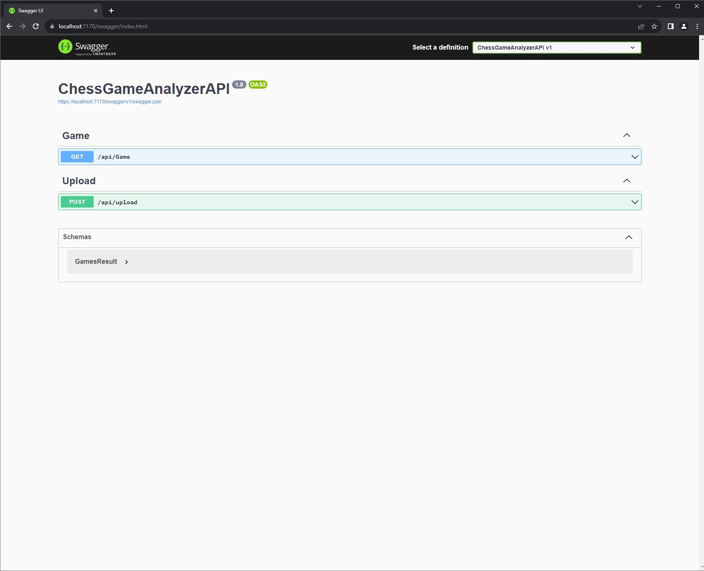

# LinqProject-API

LinqProject-API is a web application designed to visualize your chess game stats

The application is built with a C# .NET 6.0 backend API, and you can download the Angular interface from the LinqProject-Angular repository : https://github.com/jorisreynes/LinqProject-Angular

You need to download your data from Chess.com and upload it with the Angular frontend, or with Postman

## How to install it :

````
git clone https://github.com/jorisreynes/LinqProject-API.git
````

````
cd LinqProject-API
````

- Open the solution with Visual Studio (or another IDE if you prefer)

- Launch the project

You will have access to the Swagger interface


